# s3-udc2

AWS S3-backed [User-Defined C2](https://hstechdocs.helpsystems.com/manuals/cobaltstrike/current/userguide/content/topics/listener-infrastructure_user-defined-c2.htm) (UDC2) implementation for Cobalt Strike.


**Features:**

- UDC2 over AWS S3 buckets.
- Hot-swappable runtime configuration: migrate Beacon to use another S3 bucket.
- Configuration patching during listener creation: add new listeners without
  re-compiling the UDC2 BOF.
- Cobalt Strike GUI and console integartion.

## Prerequisites

- Cobalt Strike 4.13+
- AWS Account + [Terraform](https://developer.hashicorp.com/terraform)

Please refer to Terraform’s official [installation guide](https://developer.hashicorp.com/terraform/tutorials/aws-get-started/install-cli) to install the Terraform CLI for your operating system.

## Quick Start

This section shows the minimum steps to get s3-udc2 running. For more details, see the [Architecture](#architecture), [Configuration & Options](#configuration--options), and [Security & OpSec Notes](#security--opsec-notes) sections below.

### 1. Download the release

1. Download the [latest release](/../../releases/latest) archive.
2. Extract it to a directory of your choice:

```bash
tar -xvf s3-udc2-linux-amd64-v1.0.0.tar.gz
cd s3-udc2-linux-amd64
```

The package contains:

- `s3-udc2.cna`: Cobalt Strike Aggressor script to perform s3-udc2 related tasks.
- `infra.tf`: Terraform configuration to deploy the required AWS infrastructure.
- `s3-udc2-relay`: The relay server to forward messages between S3 and Team Server.
- `s3-udc2-presign`: Helper binary for generating the required config for the s3-udc2 BOF.
- `bofs/*.o`: Pre-built BOF binaries.

### 2. Deploy AWS infrastructure via Terraform

1. Ensure your AWS credentials are [configured](https://docs.aws.amazon.com/cli/latest/userguide/getting-started-quickstart.html) in your terminal session.
2. From the release directory, initialize and apply the Terraform configuration.
   This deploys the required infrastructure to AWS.

```bash
terraform init
terraform apply
```

3. After a successful deployment, export the Terraform outputs to `config.json`:

```bash
terraform output -json > config.json
```

This `config.json` file will be used by both the relay and the presign helper to
load the channel configuration.

> [!CAUTION]
> This file contains sensitive credential material (IAM access keys and secret keys). Treat it as a secret and handle it carefully.

### 3. Generate the configuration for the s3-udc2 BOF

```bash
./s3-udc2-presign --output migrate --config config.json > s3-udc2.state
```

This produces the `s3-udc2.state` file, containing the configuration values that will be patched into or compiled with the BOF as needed.

### 4. Load `s3-udc2.cna` into the Cobalt Strike Client

1. In the Cobalt Strike client, open **Cobalt Strike → Script Manager**.
2. Click **Load** and select `s3-udc2.cna` from the release directory.

### 5. Create the s3-udc2 listener

1. In the Cobalt Strike client, open the **S3-UDC2** menu and select **Import Listener.**
2. Select the recently created `s3-udc2.state` file.
3. Fill in:
   - **Listener Name**: a descriptive name for the listener
   - **Port (Bind)**: port on which the UDC2 listener will bind
4. Confirm and create the listener.

This operation patches the configuration into the `bofs/s3-udc2-patchable.<arch>.o` template and creates two listeners: `<listener name>-x64` and `<listener name>-x86`.


### 6. Start the s3-udc2 relay

Start the relay process, pointing it at the generated `config.json`:

```bash
./s3-udc2-relay \
    --config config.json \
    --udc2-listener-host [team server ip] \
    --udc2-listener-port [udc2 listener port] \
    sqs
```

The relay will handle communication between Team Server and the S3 bucket.

### 7. Verify the connection

Execute a Beacon and verify that the relay receives C2 frames:

```text
INFO udc2_relay::clue: received metadata from C2 ctx=4d867091-43fa-49cf-95fd-4ec0e8ca1237
INFO udc2_relay::clue: new beacon ctx=4d867091-43fa-49cf-95fd-4ec0e8ca1237
INFO udc2_relay::udc2: new udc2 listener connection established
INFO s3_udc2_relay::s3::producer: forwarding frame to S3 key=s2c/4d867091-43fa-49cf-95fd-4ec0e8ca1237 nonce=6936033990361397401 len=13
INFO udc2_relay::clue: received frame from C2 ctx=4d867091-43fa-49cf-95fd-4ec0e8ca1237
INFO udc2_relay::clue: forwarding frame to ts ctx=4d867091-43fa-49cf-95fd-4ec0e8ca1237
```

If you do not see the above output, please refer the [Troubleshooting](#troubleshooting) section.

## Usage

The s3-udc2 BOF uses a time-limited authentication token to upload objects to an S3 bucket. The token is generated by the `s3-udc2-presign` helper and, by default, expires after **7 days** (the maximum allowed). To update tokens nearing expiration, s3-udc2 includes a small set of utility BOFs that let you inspect and update its internal state at runtime.

### `s3-udc2-expiry`

Query and display the current token expiration time.

```
beacon> s3-udc2-expiry

[*] Tasked Beacon to query the presigned URL expiration date
[+] host called home, sent: 2764 bytes
[+] Expiration date: 2025-12-08T13:11:10Z (5d 2h 34m 4s)
```

### `s3-udc2-state`

Print the whole state of the s3-udc2 BOF.

```
beacon> s3-udc2-state

[*] Tasked Beacon to print the S3 UDC2 configuration
[+] host called home, sent: 2716 bytes
[+] received output:
State:
	SessionId:            183b17d4-f72e-49c0-9661-b6d4ed1817cc
	Nonce:                12485872681606639341
	Max Frame Retries:    10
	Frame Retry Delay:    2000 ms
S3 Info:
	S3 Host:              DOC-EXAMPLE-BUCKET.s3.eu-central-1.amazonaws.com
	S3 Download Key:      s2c
	S3 Upload Key:        c2s/${filename}
	S3 Auth Info:
		x-amz-credential:   AKIA-EXAMPLE-KEY/20251201/eu-central-1/s3/aws4_request
		x-amz-date:         20251201T131110Z
		x-amz-signature:    ecb206a477696544d3f038f4dd42ddd270fcbfc0ef3e4bc4fc38a42ee56b3f82
		Policy:             eyJjb25kaXRpb25zIjpbWyJzdGFydHMtd2l0aCIsIiRrZXkiLCJjMnMvIl0sWyJjb250ZW50LWxlbmd0aC1yYW5nZSIsMCwxMDAwMF0seyJidWNrZXQiOiJ0aGVyZSBpcyBubyBzcG9vbiJ9LHsieC1hbXotYWxnb3JpdGhtIjoiQVdTNC1ITUFDLVNIQTI1NiJ9LHsieC1hbXotY3JlZGVudGlhbCI6IkFLSUEtRVhBTVBMRS1LRVkvMjAyNTEyMDEvZXUtY2VudHJhbC0xL3MzL2F3czRfcmVxdWVzdCJ9LHsieC1hbXotZGF0ZSI6IjIwMjUxMjAxVDEzMTExMFoifV0sImV4cGlyYXRpb24iOiIyMDI1LTEyLTA4VDEzOjExOjEwWiJ9
```

### `s3-udc2-migrate <path to s3-udc2.state>`

Migrate the BOF to a new configuration (for example, one generated with new authentication information).

```
beacon> s3-udc2-migrate some/path/s3-udc2.state

[*] Tasked Beacon to migrate S3 UDC2 configuration
[+] s3-x-amz-signature -> ecb206a477696544d3f038f4dd42ddd270fcbfc0ef3e4bc4fc38a42ee56b3f82
[+] s3-x-amz-credential -> AKIA-EXAMPLE-KEY/20251201/eu-central-1/s3/aws4_request
[+] s3-upload-key -> c2s/${filename}
[+] s3-download-key -> s2c
[+] s3-x-amz-date ->20251201T131110Z
[+] s3-host -> DOC-EXAMPLE-BUCKET.s3.eu-central-1.amazonaws.com
[+] s3-x-amz-policy -> eyJjb25kaXRpb25zIjpbWyJzdGFydHMtd2l0aCIsIiRrZXkiLCJjMnMvIl0sWyJjb250ZW50LWxlbmd0aC1yYW5nZSIsMCwxMDAwMF0seyJidWNrZXQiOiJ0aGVyZSBpcyBubyBzcG9vbiJ9LHsieC1hbXotYWxnb3JpdGhtIjoiQVdTNC1ITUFDLVNIQTI1NiJ9LHsieC1hbXotY3JlZGVudGlhbCI6IkFLSUEtRVhBTVBMRS1LRVkvMjAyNTEyMDEvZXUtY2VudHJhbC0xL3MzL2F3czRfcmVxdWVzdCJ9LHsieC1hbXotZGF0ZSI6IjIwMjUxMjAxVDEzMTExMFoifV0sImV4cGlyYXRpb24iOiIyMDI1LTEyLTA4VDEzOjExOjEwWiJ9
[+] state packed
[+] host called home, sent: 3500 bytes
[+] received output:
Changing 7 entries, see you on the other side...
[+] received output:
Done!
```

### `s3-udc2-migrate-ex <key> <value> ...`

Change individual settings (one or more key–value pairs) without replacing the entire configuration.

```
beacon> s3-udc2-migrate-ex frame-retry-delay 3000 max-frame-retries 5

[+] max-frame-retries -> 5
[+] frame-retry-delay -> 3000
[+] state packed
[*] Tasked Beacon to migrate S3 UDC2 configuration
[+] host called home, sent: 2736 bytes
[+] received output:
Changing 2 entries, see you on the other side...
[+] received output:
Done!
```

## Build From Source

If you prefer to build from source rather than use the prebuilt release, follow these steps to build the binaries and BOFs from a fresh clone.

### 1. Clone the Repository

```bash
git clone https://github.com/Cobalt-Strike/s3-udc2.git
cd s3-udc2
```

### 2. Install Build Dependencies

- [Rust](https://rust-lang.org/tools/install/) (Tested on Stable 1.91.1)
- [Mingw-w64](https://www.mingw-w64.org) toolchain or [Visual Studio](https://visualstudio.microsoft.com)

### 3. Build Everything

From the project root, build the relay (`s3-udc2-relay`) and presign helper (`s3-udc2-presign`) in one step:

```bash
cargo build --release
```

The build system also detects if **mingw-w64** is installed and will automatically build the BOFs during this step.

### 4. Build the BOFs Separately

If you want to build the BOFs separately:

**Linux / macOS**

```bash
cd s3-udc2-bof
make all
```

**Windows (Visual Studio)**

1. Open the Visual Studio solution:

   ```text
   s3-udc2-bof/s3-udc.sln
   ```

2. Build the **Release** configuration for both **x64** and **x86** targets.

After this step you have fresh s3-udc2 BOF files under `s3-udc2-bof/bofs` that match the ones shipped in the release archive.

## Architecture

During initialization, the s3-udc2 BOF generates a random UUID and uses it as the session ID.

Beacon uploads C2 frames as objects to `s3://<bucket>/<upload prefix>/<session id>`. S3 emits object-created events to an SQS queue that the relay consumes. For each event the relay downloads the object and forwards the frame to the Team Server, and then uploads the Team Server's reply to `s3://<bucket>/<download prefix>/<session id>`. The Beacon polls the download URL to receive new tasks.

The BOF does not embed long-term IAM credentials. Instead it uses a [presigned POST request](https://docs.aws.amazon.com/AmazonS3/latest/API/sigv4-UsingHTTPPOST.html) with a policy that restricts uploads to the `<upload prefix>/` path and enforces a maximum upload size. By default the presign helper creates the presigned URL with the maximum allowed [expiration time](https://docs.aws.amazon.com/AmazonS3/latest/userguide/using-presigned-url.html#PresignedUrl-Expiration) (7 days).

Because AWS does not support a wildcard presigned URL for downloading objects under a given path, objects placed under `<download prefix>/` must be publicly readable for the Beacon to access them. In practice, this means that if somebody knows the session ID, they can fetch reply objects under `s3://<bucket>/<download prefix>/<session id>` without authentication. However, the data itself is encrypted by Cobalt Strike.

The Terraform stack deploys a minimal set of AWS resources to support this flow:

- **One S3 bucket** for all C2 traffic, with:
  - A bucket policy that makes objects under the download prefix (default: `s2c/`) publicly readable.
  - A lifecycle rule that **expires objects after 2 days**.
- **An SQS queue** wired to the bucket so that any new object under the upload prefix (default: `c2s/`) generates a notification consumed by the relay.
- **A relay IAM user** with just enough permissions to:
  - Read/write/delete objects in the bucket.
  - Receive and delete messages from the SQS queue.
- **A write-only IAM user** restricted to:
  - `s3:PutObject` under the upload prefix only, used to generate the presigned upload URLs.



Besides the event-driven model, the relay supports a **polling mode** that periodically lists objects under the upload prefix and processes new frames. In this mode the SQS queue is not required.

## Configuration & Options

### AWS Infrastructure

These variables are defined in `infra.tf` and control how the backend is provisioned:

- `bucket_name`: The S3 bucket name for C2 traffic. (default: a random UUID)
- `server_to_client_prefix`: The key prefix for **Team Server → Beacon** frames (default: `s2c`).
- `client_to_server_prefix`: The key prefix for **Beacon → Team Server** frames (default: `c2s`).
- `aws_region`: AWS region where all resources (S3, SQS, IAM) are created (default: `eu-central-1`).

### S3-udc2 BOF Configuration

The following preprocessor definitions are declared in `s3-udc2-bof/s3-config.h`:

- `USER_AGENT`: The `User-Agent` header value used by the Beacon when performing HTTP requests.
- `MAX_FRAME_RETRIES`: Maximum number of times the Beacon will retry sending or receiving a frame before giving up on that operation.
- `FRAME_RETRY_DELAY_MS`: Delay (in milliseconds) between retry attempts; controls how aggressively the Beacon retries failed requests.
- `C2_STATE_KEY`: The key name used in the Beacon's key-value store to hold a pointer to the state object. Leaving this undefined disables the runtime migration feature.
- `S3_HOST`: The endpoint of the S3 bucket used for C2 traffic.
- `S3_UPLOAD_KEY`: Key prefix used for **Beacon → Team Server** frames.
- `S3_DOWNLOAD_KEY`: Key prefix used for **Team Server → Beacon** frames.
- `X_AMZ_CREDENTIAL`: The AWS Signature V4 credential scope used in the authorization.
- `X_AMZ_DATE`: The request timestamp in ISO8601 basic format used in signed requests.
- `X_AMZ_SIGNATURE`: The hex-encoded Signature V4 string for the presigned POST request.
- `X_AMZ_POLICY`: Base64-encoded policy document used for S3 POST uploads.

> [!NOTE]
> The `s3-udc2.cna` Aggressor Script uses a prebuilt template BOF and patches your configuration into the object file when the listener is created. You do not need to manually edit `s3-config.h` for normal operation.
>
> If you prefer to embed a predefined configuration at build time and not use the s3-udc2 Aggressor Script, generate the header from your config:
>
> ```bash
> ./s3-udc2-presign --output header --config config.json > s3-udc2-bof/s3-config.h
> ```
>
> For more details, see [Build From Source](#build-from-source).

## Security & OpSec Notes

- The S3 bucket details and upload auth token are embedded into Beacon. If the Beacon sample is recovered (for example, uploaded to VirusTotal), a defender can extract:
  - the bucket name
  - the IAM access key ID
  - authentication token to upload objects
  - the upload & download prefixes
- If the upload auth token is still valid, it can be abused to upload arbitrary objects under `<upload prefix>/`. The maximum object size is limited by your configuration, but this still represents write access to that bucket path.
- Objects under `<download prefix>/` (Team Server → Beacon frames) are publicly readable. However, the object names are random UUIDs and listing is disabled, but anyone who learns a valid object key can read it. However, the data itself is encrypted by Team Server.
- Each [S3](https://aws.amazon.com/s3/pricing/) and [SQS](https://aws.amazon.com/sqs/pricing/) operation has a cost. Estimate expected running costs for your usage pattern beforehand.

## Troubleshooting

### Terraform: `No valid credential sources found`

This error means the AWS provider could not find any valid credentials in the places the AWS SDK checks (environment, shared credentials file, EC2 metadata, etc.). Please refer to Terraform’s AWS provider [documentation](https://registry.terraform.io/providers/hashicorp/aws/latest/docs) for guidance on resolving these credential issues.

### Relay does not receive C2 frames from S3

Verify that the configuration used to generate the presigned URL is valid:

```bash
./s3-udc2-presign --verify --config config.json

INFO s3_udc2_presign: successfully uploaded the test file into S3
```

At the same time, the relay process should print:

```
INFO s3_udc2_relay::s3::consumer: received a test object ctx=verify_eb579c6e-7858-4d33-9d2c-382d06b120fa
```

Troubleshooting steps:

- If the relay does not receive the test object, confirm the relay is using the correct configuration file.
- If the relay receives the test object but does not receive frames from Beacon, ensure the s3-udc2 listener is using the `s3-udc2.state` configuration file generated from the same `config.json` that the relay is using.
- If the relay still does not receive frames, run the s3-udc2 BOF in debug mode and verify the `uploadFrame` function in `s3-udc2-bof/s3-udc2.cpp` completes successfully. For example, set a breakpoint at the end of the function and confirm the returned HTTP status code is 204. If the status is not 204, the configuration is incorrect. For more details, see [Debug Build](#debug-build).

### Relay cannot forward frames to Team Server

If the relay logs the following error:

```
ERROR udc2_relay::clue: could not connnect to teamserver err=I/O error: Connection refused (os error 60)
```

Make sure the host running the relay can reach the Team Server, and that the
`--udc2-listener-host` and `--udc2-listener-port` arguments are correct.

## Debug Build

The Visual Studio solution provides the `Debug` target, which lets you troubleshoot the s3-udc2 BOF directly in Visual Studio's debugger. You can also build the same debug executable with `mingw-w64` by running `make debug`.

The debug executable requires the configuration to be compiled directly into the BOF. Use the `s3-udc2-presign` tool to generate the required C header file:

```bash
cargo run --bin s3-udc2-presign -- --output header --config config.json > s3-udc2-bof/s3-config.h
```

Additionally, the Debug target requires the UDC2 listener's IP address and port. These are automatically read from the `UDC2_DEBUG_HOST` and `UDC2_DEBUG_PORT` environment variables at compile time. If you prefer not to set those environment variables, you can change their default values in `s3-udc2-bof/base/debug.cpp`.

> [!NOTE]
> The s3-udc2-migrate BOF is not able to access the mocked Beacon's key-value store, and
> therefore the runtime state migration cannot be tested in the debug build.
